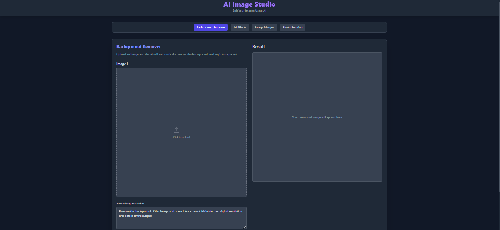

# 🧠 AI Image Studio  
_Edit Your Images Using AI_  

---

## 🚀 Overview  
**AI Image Studio** is a modern web-based image editing tool powered by AI.  
It allows users to easily remove backgrounds, apply effects, merge photos, and much more — all through an intuitive and minimal interface.  

---

## ✨ Features  
- 🖼️ **Background Remover** – Instantly remove image backgrounds and make them transparent.  
- 🎨 **AI Effects** – Apply stunning visual effects using AI.  
- 🧩 **Image Merger** – Combine multiple images effortlessly.  
- 👥 **Photo Reunion** – Smart AI feature to merge faces and restore old photos.  
- ⚡ Fast, responsive, and privacy-friendly — all processing handled securely.  

---

## 🧰 Tech Stack  
- **Frontend:** React + Tailwind CSS  
- **Backend:** Node.js (optional)  
- **AI Integration:** OpenRouter API  

---

## ⚙️ Setup Instructions  

1️⃣ Clone the Repository  

git clone https://github.com/joytechs247/ai-image-studio.git
cd ai-image-studio

2️⃣ Install Dependencies
npm install

3️⃣ Create .env.local file

OPENROUTER_API_KEY=your_api_key

4️⃣ Run the Project
npm run dev

Usage

Upload an image in the Background Remover tab.
The AI automatically removes the background and displays the result.
You can download the processed image in full resolution.

Future Improvements

Add image restoration and enhancement tools
Add batch background removal
Multi-language interface
